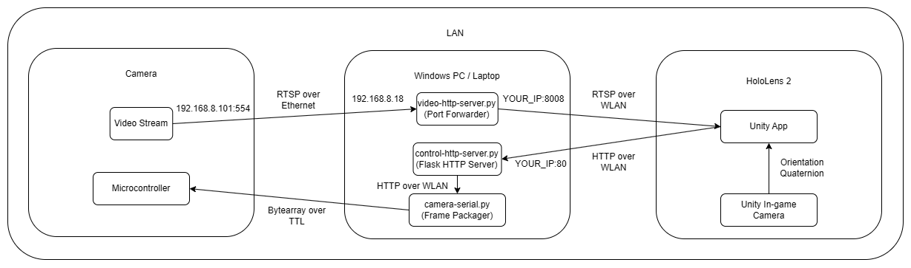

Gimbal Camera Shadowing with HoloLens 2
==============

This Unity 2022.3.37f1 app using MRTK3 allows a user to control a GT05V gimbal camera along 2 DoF by moving their head while wearing a HoloLens 2. Testing on a corporate WLAN, control commands have a latency of ≈100ms, whereas the RTSP video stream has a latency of ≈2.5s.

## Requirements:
* Hololens 2 
* Windows 11 computer with: 
  * Python 3.12 and Flask 3.0.3.
  * [Visual Studio 2022](https://learn.microsoft.com/en-us/windows/mixed-reality/develop/install-the-tools) only. **Make sure to install the specified workloads in the table shown in the link.** 
  * Unity 2022.3.37f1 and the Mixed Reality Feature Tool, by following the instructions [here](https://learn.microsoft.com/en-us/windows/mixed-reality/develop/unity/unity-development-overview).
* GT05V Gimbal Camera (for other cameras, change ``.\Server\camera-serial.py`` as necessary)

## Instructions:

### Computer: 

* Connect the gimbal camera to your laptop with the USB (for serial commands) and Ethernet (for RTSP stream) cables. 
* **For GT05V Gimbal Camera**: Manually set your Ethernet connection's IPv4 address to ``192.168.8.18``, and the IPv4 mask to ``255.255.255.0``. By default, the camera's video output can be streamed at ``rtsp://192.168.8.101:554/live/0``; thus, there is no need to change ``remote_host`` and ``remote_port`` in `.\Server\config.json`
* Change ``serial_port`` in `.\Server\config.json` to match the camera's port. To find out your port number, check for a new device under 'Ports (COM & LPT)' in Device Manager on Windows, after plugging in the USB connector.
* Run ``python .\Server\run-all.py`` on your computer. Make sure no other apps are using ports 80 and 8008, and that ``serial_port`` is correct.
  
### HoloLens 2: 
* Making sure your laptop and HoloLens 2 are in the same LAN, import the whole folder as a Unity Project, and follow the instructions in the "Build your application in Unity" and "(Optional) Build and deploy the application" sections [here](https://learn.microsoft.com/en-us/training/modules/learn-mrtk-tutorials/1-7-exercise-hand-interaction-with-objectmanipulator). That is, you'll have to build in Unity, then deploy the generated Visual Studio solution.
* When you're done, you should see an app called "Shadowing" in the start menu of your HoloLens 2. Open it.
* In the Unity app, assuming the default settings in `.\Server\config.json` have been unchanged, the Video Stream MRL should be `rtsp://_YOUR_COMPUTER_IP_:8008/live/0`, and the Control Stream MRL should be `http://_YOUR_COMPUTER_IP_:80/orientation`.
  
  

## Block Diagram:

